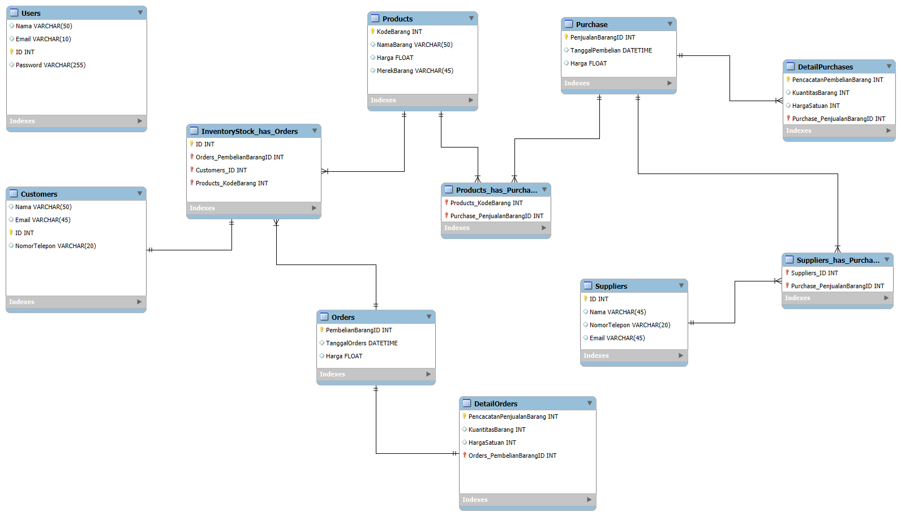

# 📦 Aplikasi-Database-Stocks

Aplikasi manajemen stok barang yang digunakan untuk mencatat data produk, transaksi pembelian dan penjualan, pelanggan, serta supplier secara terintegrasi.

## 🚀 Fitur

- Pengelolaan data produk dan stok
- Pencatatan transaksi pembelian dan penjualan
- Detail pesanan dan pembelian barang
- Manajemen pelanggan dan supplier
- Struktur database relasional menggunakan SQL Server

---

## ⚙️ Langkah Instalasi

### 1. Clone Repository

```bash
git clone https://github.com/justynwen0/Aplikasi-Database-Stocks
cd Aplikasi-Database-Stocks
```

### 2. Konfigurasi Database

Salin file konfigurasi contoh:

```bash
cp dbconfig.env.example dbconfig.env
```

Edit file `dbconfig.env` sesuai dengan konfigurasi SQL Server lokal Anda:

```env
Data Source=NamaPCAnda\SQLEXPRESS;Initial Catalog=ApkDatabaseStocks;Integrated Security=True;TrustServerCertificate=True
```

> Ganti `NamaPCAnda` dengan nama komputer lokal Anda.

### 3. Jalankan Skrip Database

Buka SQL Server Management Studio (SSMS), lalu jalankan file berikut untuk membuat struktur database:

```
DataBase Stocks.sql
```

---

## 🧩 Entity Relationship Diagram (ERD)

Berikut adalah gambaran struktur relasi tabel dalam aplikasi ini:



---

## 🔐 Informasi Login Default

Gunakan akun berikut untuk login ke dalam sistem:

```txt
Username : admin
Password : 123
```
